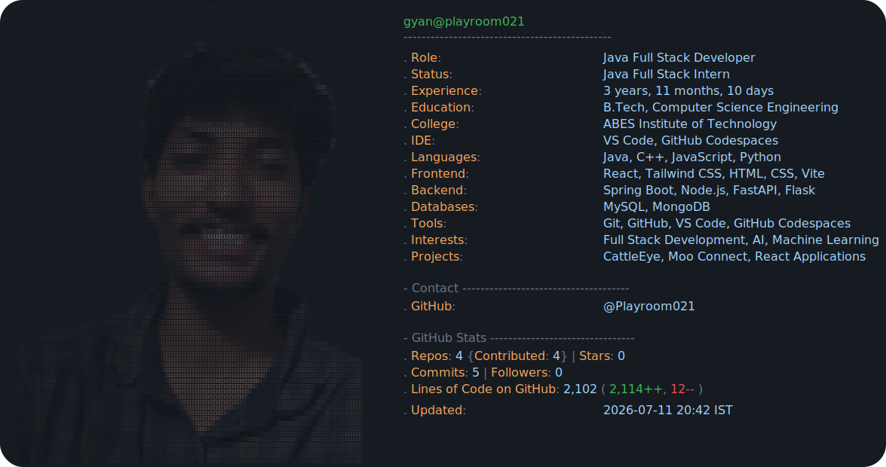

<picture>
  <source media="(prefers-color-scheme: dark)" srcset="./dark_mode.svg">
  <source media="(prefers-color-scheme: light)" srcset="./light_mode.svg">
  
</picture>

  <a href="https://github.com/Playroom021">@Playroom021</a>

<!-- <picture>
  <source media="(prefers-color-scheme: dark)" srcset="https://raw.githubusercontent.com/Playroom021/Playroom021/main/dark_mode.svg?v=2">
  <source media="(prefers-color-scheme: light)" srcset="https://raw.githubusercontent.com/Playroom021/Playroom021/main/light_mode.svg?v=2">
  
</picture>

  <a href="https://github.com/Playroom021">@Playroom021</a>

 -->

<!--
  This README is rendered from dark_mode.svg / light_mode.svg (chosen
  automatically based on the viewer's GitHub theme via the <picture> tag
  above). Both files are generated by scripts/update_readme.py -- see that
  file for configuration: name, role, tech stack, contact links, etc.

  To (re)generate after editing your info or swapping your portrait:
    python3 scripts/generate_portrait.py path/to/your-portrait.png
    python3 scripts/update_readme.py

  The GitHub Actions workflow in .github/workflows/readme.yml re-runs
  update_readme.py automatically on every push and once a day, so your
  GitHub stats (repos, stars, commits, lines of code) stay current.
-->
